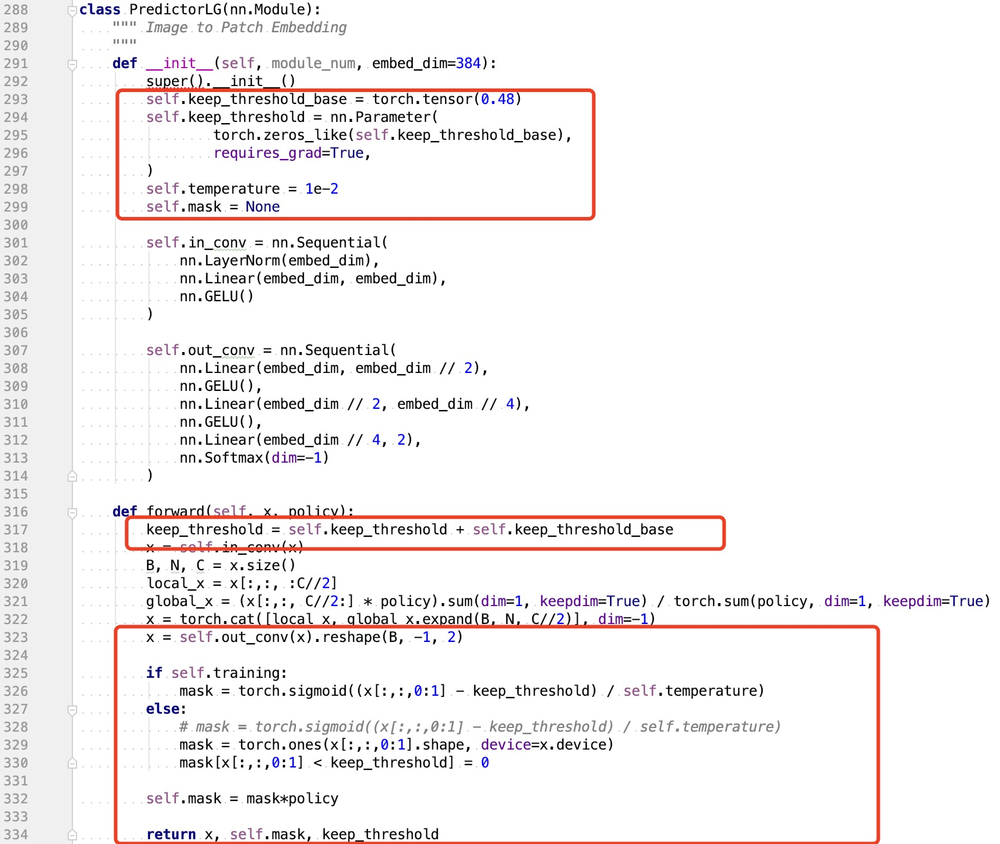

# SPViT: Enabling Faster Vision Transformers via Latency-aware Soft Token Pruning

This repository contains PyTorch training code for the ECCV 2022 paper.

[arXiv](https://arxiv.org/abs/2112.13890) |  [ECCV 2022](https://www.ecva.net/papers/eccv_2022/papers_ECCV/papers/136710618.pdf)


## Usage

### Environment Settings

```
conda create -n spvit python=3.6

conda activate spvit

conda install pytorch==1.8.0 torchvision==0.9.0 torchaudio==0.8.0 -c pytorch

pip3 install timm==0.4.5
```

### Data preparation 
download and extract ImageNet images from http://image-net.org/. The directory structure should be

```
│ILSVRC2012/
├──train/
│  ├── n01440764
│  │   ├── n01440764_10026.JPEG
│  │   ├── n01440764_10027.JPEG
│  │   ├── ......
│  ├── ......
├──val/
│  ├── n01440764
│  │   ├── ILSVRC2012_val_00000293.JPEG
│  │   ├── ILSVRC2012_val_00002138.JPEG
│  │   ├── ......
│  ├── ......
```

### Download prertained model for training 

```
sh download_pretrain.sh
```

### Training


**DeiT-S**

```
CUDA_VISIBLE_DEVICES="0,1,2,3"  python3 -u -m torch.distributed.launch --nproc_per_node=4 --use_env main_l2_vit_3keep_senet.py 
                                --output_dir logs/3keep_senet 
                                --arch deit_small 
                                --input-size 224 
                                --batch-size 256 
                                --data-path /data/ImageNet_new/ 
                                --epochs 30 
                                --dist-eval 
                                --distill 
                                --base_rate 0.7 
```
**DeiT-B**

```
CUDA_VISIBLE_DEVICES="0,1,2,3"  python3 -u -m torch.distributed.launch --nproc_per_node=8 --use_env main_l2_vit_3keep_senet.py 
                                --output_dir logs/deit_base_3keep_senet_256_60_5e-4 
                                --arch deit_base 
                                --input-size 224 
                                --batch-size 256 
                                --data-path /data/ImageNet_new/ 
                                --epochs 60 
                                --dist-eval 
                                --distill 
                                --base_rate 0.7 

```


### Inference

```
python infer.py --data-path /home/imagenet --model deit_small --model-path checkpoint_best.pth --base_rate 0.7 
```


### Some hyperparameter tunning results 
https://docs.google.com/spreadsheets/d/1k25sS_-mmQyIvpIrn32GUw3eRuYcCy0cN0OSOq0QGFI/edit?usp=sharing

### score 
https://drive.google.com/drive/folders/1diICKopeYL7H84Wsr0Xxh30e9xh6RX2d?usp=sharing

### Full precision training 
To turn off the amp function, go to ```engine_l2.py```  ```train_one_epoch()``` and ```evaluate()```

<p align="center">
   <br>
</p>


## Acknowledgements

Our code is based on [pytorch-image-models](https://github.com/rwightman/pytorch-image-models), [DeiT](https://github.com/facebookresearch/deit), [DynamicViT](https://github.com/raoyongming/DynamicViT).

## Citation
If you find our work useful in your research, please consider citing:
```
@inproceedings{kong2022spvit,
  title={SPViT: Enabling Faster Vision Transformers via Latency-Aware Soft Token Pruning},
  author={Kong, Zhenglun and Dong, Peiyan and Ma, Xiaolong and Meng, Xin and Niu, Wei and Sun, Mengshu and Shen, Xuan and Yuan, Geng and Ren, Bin and Tang, Hao and others},
  booktitle={Computer Vision--ECCV 2022: 17th European Conference, Tel Aviv, Israel, October 23--27, 2022, Proceedings, Part XI},
  pages={620--640},
  year={2022},
  organization={Springer}
}
```

